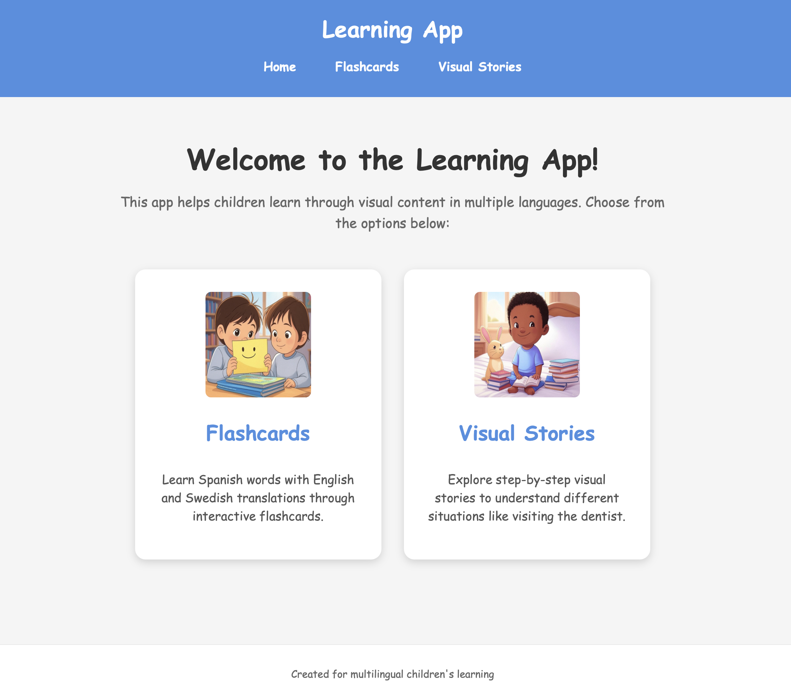

# Multilingual Learning App

A Next.js application designed for children with autism to learn languages and understand social situations. The app features Spanish flashcards with English and Swedish translations as well as visual stories that explain step-by-step processes for different situations.



## Features

### Homepage
- Simple navigation between flashcards and visual stories
- Kid-friendly interface with large buttons and clear visuals

### Flashcards
- Spanish vocabulary with English and Swedish translations
- Visual images for each word
- Interactive tap-to-reveal translations
- Navigation through multiple cards

### Visual Stories
- Step-by-step visual guides for social situations
- Currently features "Visiting the Dentist" with all steps
- Supports multiple languages (English, Swedish, Spanish)
- Interactive navigation with step indicators

## Project Structure

```
learning-app/
├── components/
│   └── Layout.js
├── data/
│   ├── flashcards.json
│   └── dentist-visit.json
├── pages/
│   ├── _app.js
│   ├── index.js
│   ├── flashcards.js
│   ├── stories.js
│   └── stories/
│       └── [id].js
├── public/
│   ├── favicon.ico
│   ├── images/
│   │   ├── flashcards-icon.png
│   │   ├── stories-icon.png
│   │   ├── hello.png
│   │   ├── thankyou.png
│   │   └── ... (other flashcard images)
│   │   └── dentist/
│   │       ├── appointment.png
│   │       ├── family.png
│   │       └── ... (other dentist visit images)
│   │   └── stories/
│   │       └── dentist-preview.png
├── styles/
│   ├── globals.css
│   ├── Home.module.css
│   ├── Layout.module.css
│   └── Stories.module.css
├── next.config.js
├── package.json
├── netlify.toml
└── README.md
```

## Setup and Development

1. **Clone the repository**

2. **Install dependencies**
   ```bash
   npm install
   ```

3. **Add your images**
   - For flashcards: add images to `/public/images/`
   - For visual stories: add images to appropriate folders like `/public/images/dentist/`
   - Add icon images to `/public/images/flashcards-icon.png` and `/public/images/stories-icon.png`

4. **Run the development server**
   ```bash
   npm run dev
   ```

5. **Open your browser**
   Navigate to [http://localhost:3000](http://localhost:3000)

## Deployment to Netlify

1. **Push your code to GitHub**

2. **Connect to Netlify**
   - Log in to Netlify (https://www.netlify.com/)
   - Click "New site from Git"
   - Select your GitHub repository
   - Use the following build settings:
     - Build command: `npm run build`
     - Publish directory: `out`
   - Click "Deploy site"

3. **Set up custom domain**
   - In Netlify dashboard, go to "Domain settings"
   - Click "Add custom domain"
   - Enter your domain (e.g., "flashcard.cristianecheverria.com")
   - Follow the instructions to configure DNS settings

## Customization

### Editing Flashcards

To modify flashcards, edit the `data/flashcards.json` file. Each flashcard requires:

- `id`: Unique identifier
- `spanish`: Spanish word
- `english`: English translation
- `swedish`: Swedish translation
- `imageUrl`: Path to image in `/public/images/`
- `altText`: Alternative text for accessibility

### Adding Visual Stories

1. **Create a new JSON file** in the `/data/` directory (e.g., `school-day.json`)
2. **Follow the structure** of the existing story files with title and steps
3. **Add corresponding images** in a new folder (e.g., `/public/images/school/`)
4. **Add the story to the list** in `pages/stories.js`

### Styling Changes

- Modify CSS in the various `.module.css` files
- Change colors, fonts, and spacing to better suit your child's preferences

## Accessibility Features

This application is designed with accessibility in mind:

- Clear, predictable navigation
- High contrast text
- Visual supports for all content
- Alternative text for images
- Kid-friendly interface
- Multilingual support

## License

This project is open source and available for personal or educational use.
